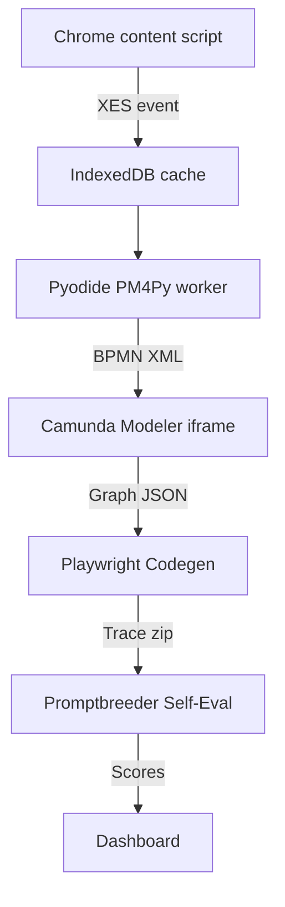

# FlowPilot

> Record any sequence of browser actions, visualize it as a BPMN workflow, and export a robust Playwright script that continuously self-heals with Promptbreeder-style evaluations.

Inspired by the growing need for AI copilots that bridge human workflows and reliable automation — the very mission of Dex/Joindex — FlowPilot turns everyday web clicks into production-grade test or RPA scripts in seconds. :contentReference[oaicite:0]{index=0}

---

## ✨ Key features

| Capability                              | What it does                                                                 | Tech under the hood                                                                    |
| --------------------------------------- | ---------------------------------------------------------------------------- | -------------------------------------------------------------------------------------- |
| **One-click recording**           | Chrome extension logs clicks, keys, nav events, spoken commands, screenshots | MV3 content scripts & background service workers :contentReference[oaicite:1]{index=1} |
| **Standards-compliant event log** | Stores sessions as XES for easy downstream mining                            | XES 2.0 spec :contentReference[oaicite:2]{index=2}                                     |
| **Automatic workflow discovery**  | Runs Inductive Miner to generate BPMN/Petri-net graphs                       | PM4Py Python lib :contentReference[oaicite:3]{index=3}                                 |
| **Visual editing**                | Embeds Camunda Modeler so users drag-drop to refine paths                    | Camunda Web Modeler :contentReference[oaicite:4]{index=4}                              |
| **Code generation**               | Traverses BPMN → emits Playwright `.spec.ts`, packs a Trace Viewer link   | Playwright core + Trace Viewer :contentReference[oaicite:5]{index=5}                   |
| **Self-healing**                  | Promptbreeder loop mutates selectors / prompts until tests pass              | Promptbreeder algorithm :contentReference[oaicite:6]{index=6}                          |
| **Conformance alerts**            | Re-plays new logs; PM4Py flags UI drift before CI breaks                     | UiPath & PM4Py process-mining best practices :contentReference[oaicite:7]{index=7}     |

---

## 🏗️ Architecture



## 🚀 Quick start

```bash
# 1. Clone and install dependencies
git clone https://github.com/your-org/flowpilot
cd flowpilot
pnpm install   # or yarn / npm

# 2. Build and load the extension
pnpm run build:chrome
# Load build/chrome in Chrome → Extensions → Load unpacked

# 3. Record a session
Click the 🌀 FlowPilot icon → **Start Recording** → do a task → **Stop**

# 4. Inspect & edit
The popup opens the BPMN graph; tweak paths, rename nodes.

# 5. Export & run
Click **Generate Script** → `flow.spec.ts` saved.  
`npx playwright test flow.spec.ts --trace on`

```

## 📈 Roadmap

* **Voice-intent overlay** – show transcripts on graph nodes
* **Edge-pruning heuristics** – simplify large graphs for non-tech users
* **Slack/Discord alerts** – send conformance-drift warnings
* **Firefox & Safari ports** – WebExtensions API compatibility

## 🤝 Contributing

1. Fork the repo and create your feature branch: `git checkout -b feat/my-feature`
2. Commit your changes with clear messages.
3. Open a pull request describing **why** the change matters.
4. All PRs run eslint, unit tests, and Playwright e2e.

## 📜 License

Dual-licensed under **MIT** for non-commercial use and **Apache 2.0** for commercial deployments. See `LICENSE` for details.

## 🙏 Acknowledgements

* [PM4Py]() for world-class process-mining algorithms.
* [Playwright](https://playwright.dev/) for rock-solid browser automation.
* Researchers behind [Promptbreeder](https://arxiv.org/abs/2309.16797).

---

## Why **FlowPilot**?

- It speaks to the project’s goal: piloting a flow of actions through recording, mining, and autonomous correction.

* It’s short, `.com` and GitHub-search friendly, and avoids collisions with existing Playwright or PM4Py repos at time of writing.

Happy hacking — and may your flows never flake!
